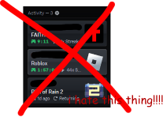

# WOW, NO ACTIVITY BAR!!! 
---

 
**i do not like this thing!!! and so i am getting rid of it!!!**

*literally anyone could make this!!!*
 
*it is one (1) line!! (excluding metadata)*

if this stops working i probably won't fix it

just download [noactivitylist.theme.css](https://github.com/instntpot/no-activity-list/blob/main/noactivitylist.theme.css) and put it in your themes folder!
 
if you use vencord you can also paste [https://raw.githubusercontent.com/instntpot/no-activity-list/main/noactivitylist.theme.css](https://raw.githubusercontent.com/instntpot/no-activity-list/main/noactivitylist.theme.css) into online themes

> "i made this" - instantpot
